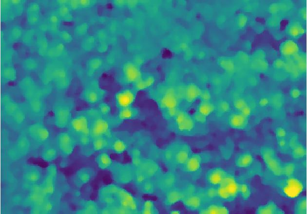
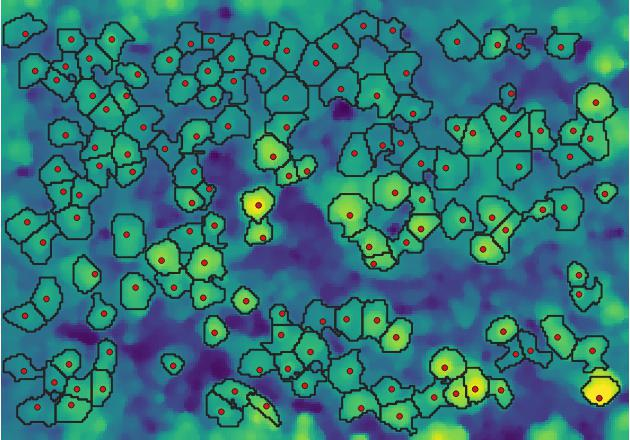
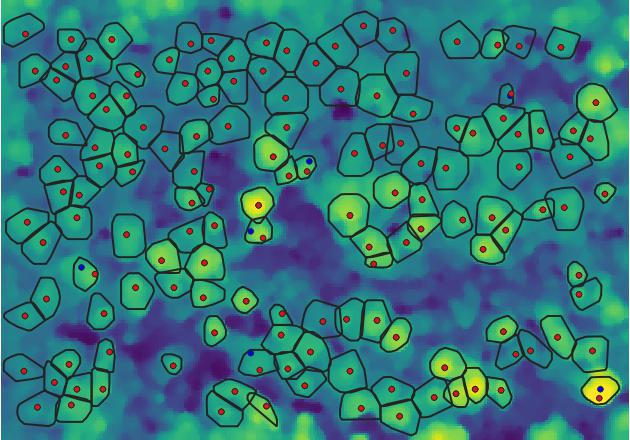
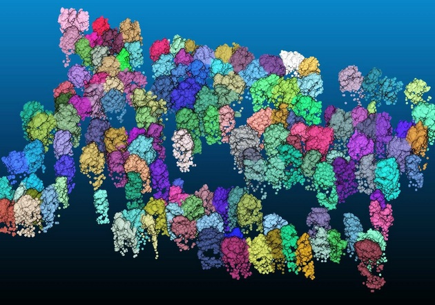

# PyCrown - Fast raster-based individual tree segmentation for LiDAR data
Author: Dr Jan Zörner (<mailto:zoernerj@landcareresearch.co.nz>)

Published under GNU GPLv3

# Summary
PyCrown is a Python package for identifying tree top positions in a canopy height model (CHM) and delineating individual tree crowns.

The tree top mapping and crown delineation method (optimized with Cython and Numba), uses local maxima in the canopy height model (CHM) as initial tree locations and identifies the correct tree top positions even in steep terrain by combining a raster-based tree crown delineation approach with information from the digital surface model (DSM) and terrain model (DTM).

*Citation:*

Zörner, J.; Dymond, J.; Shepherd J.; Jolly, B. PyCrown - Fast raster-based individual tree segmentation for LiDAR data. Landcare Research NZ Ltd. 2018, https://doi.org/10.7931/M0SR-DN55

*Research Article:*

Zörner, J., Dymond, J.R., Shepherd, J.D., Wiser, S.K., Bunting, P., Jolly, B. (2018) Lidar-based regional inventory of tall trees - Wellington, New Zealand. Forests 9, 702-71. https://doi.org/10.3390/f9110702

# Purpose and methods
A number of open-source tools to identify tree top locations and delineate tree crowns already exist. The purpose of this package is to provide a fast and flexible Python-based implementation which builds on top of already well-established algorithms.

Tree tops are identified in the first iteration through local maxima in the smoothed CHM.

We re-implement the crown delineation algorithms from **Dalponte and Coomes (2016)** in Python. The original code was published as R-package *itcSegment* (<https://cran.r-project.org/package=itcSegment>) and was further optimized for speed in the *lidR* R-package (<https://cran.r-project.org/package=lidR>).

Our Cython and Numba implementations of the original algorithm provide a significant speed-up compared to *itcSegment* and a moderate improvement over the version available in the *lidR* package.

We also adapted the crown algorithm slightly to grow in circular fashion around the tree top which gives crown a smoother, more natural looking shape.

We add an additional step to correct for erroneous tree top locations on steep slopes by taking either the high point from the surface model or the centre of mass of the tree crown as new tree top.

Reference:

**Dalponte, M. and Coomes, D.A. (2016)** *Tree-centric mapping of forest carbon density from airborne laser scanning and hyperspectral data*. Methods in Ecology and Evolution, 7, 1236-1245.

# Main outputs
* **Tree top locations** (stored as 3D ESRI .shp-file)
* **Tree crowns** (stored as 2D ESRI .shp-file)
* **Individual tree classification of the 3D point cloud** (stored as .las-file)

# Contributors
* Dr Jan Zörner (Manaaki Whenua - Landcare Research, Lincoln, New Zealand)
* Dr John Dymond (Manaaki Whenua - Landcare Research, Palmerston North, New Zealand)
* Dr James Shepherd (Manaaki Whenua - Landcare Research, Palmerston North, New Zealand)
* Dr Ben Jolly (Manaaki Whenua - Landcare Research, Palmerston North, New Zealand)

# Requirements
It is assumed that you generated a canopy height model (CHM), digital surface model (DSM) and digital terrain model (DTM) from the LiDAR dataset before running *PyCrown*.
If you want to classify individual trees in the point cloud, it is recommended to normalize heights to *height above ground elevation* (also done externally).

For processing laser scanning data we recommend the open-source software *SPDLib* (http://www.spdlib.org).

# Installation and environment set-up
**Python 3.6 is required.**

Tested on: Windows 10, Debian 9 (Stretch), Fedora 28, Ubuntu 18.04 & 16.04

## Environment set-up
### With Conda package manager (recommended)
#### Create the environment and install all required packages

`conda env create`

#### Activate the environment

Windows: `activate pycrown-env`

Linux: `source activate pycrown-env`

### With Python's venv and pip
#### Create the environment

`python -m venv pycrown-env`

Linux: `source pycrown-env/bin/activate`

Windows: `pycrown-env\Scripts\activate.bat`

#### Install all required packages

`python -m pip install --upgrade pip`

`pip install -r requirements.txt`

## Run Tests
There are only some rudimentary tests provided at the moment, but it is advised to check that everything works:

`python setup.py test`

## Install PyCrown
Build and install the PyCrown module with:

`python setup.py install`

# Common problems
## laspy.util.LaspyException: Laszip was not found on the system
On some platforms (e.g. Ubuntu 16.04) the installation of laspy does not include laszip/laszip-cli.
See the [issue report](https://github.com/laspy/laspy/issues/79) on github for more infos.

In this case, please follow these steps:

* `wget http://lastools.org/download/LAStools.zip`
* `unzip LAStools.zip && cd LAStools && make`
* `cp bin/laszip /home/USERNAME/miniconda3/envs/pycrown-env/bin/`

If you encounter this error under Windows, please download LAStools.zip, extract the archive and copy the file "laszip.exe" from the "bin"-directory to the conda environment, e.g. C:\Users\<username>\AppData\Local\Continuum\miniconda3\pycrown-env\Scripts\ or C:\Users\<username>\Miniconda3\envs\pycrown-env\Scripts

## Error while building 'pycrown._crown_dalponte_cython' extension
Building the Cython module requires C++ build tools which may need to be installed on your system.

The Windows error message on Windows provides instructions:
`error: Microsoft Visual C++ 14.0 is required. Get it with "Build Tools for Visual Studio": https://visualstudio.microsoft.com/downloads/`
During the setup process, please select 'C++ Build Tools'.

## TypeError: a bytes-like object is required, not 'FakeMmap' when trying to load .laz files
There seems to be an incompatibility between laspy and numpy in recent versions. The combination `numpy==1.16.4` and `laspy==1.5.1` works for me.
I suggest either not using .laz files for the time being or downgrading to the appropiate package versions.
Please also refer to this github issue: https://github.com/laspy/laspy/issues/112

# Getting Started
You can find an IPython Notebook demonstrating each step of the tree segmentation approach in the *example* folder.

You can also run the example python script directly. Results are stored in the *example/result* folder.

`cd example`

`python example.py`

## Main processing steps
### Step 1: Smoothing of CHM using a median filter

### Step 2: Tree top detection using local maxima filter

### Step 3: Tree Crown Delineation using an adapted Dalponte and Coomes (2016) scheme

### Step 4: Tree top correction of trees on steep slopes

### Step 5: Smoothing of crown polygons using first returns of normalized LiDAR point clouds

### Step 6: Classification of individual trees in the 3D point cloud (visualized with CloudCompare)

